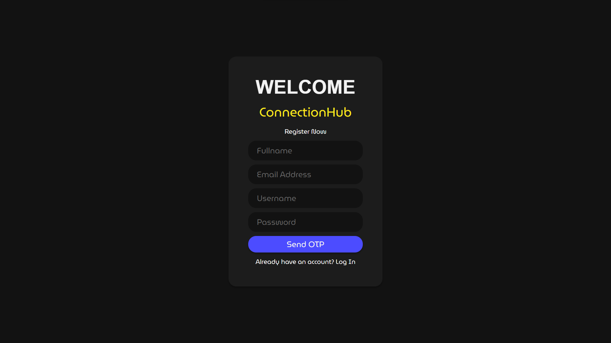
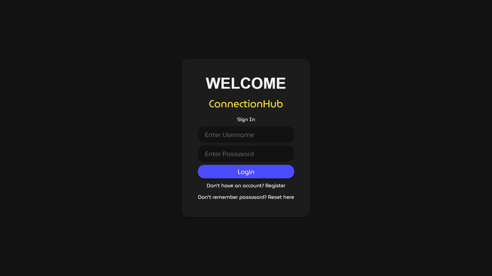
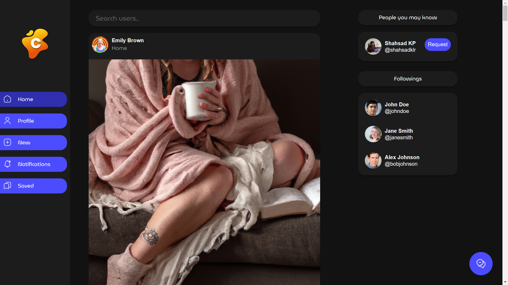
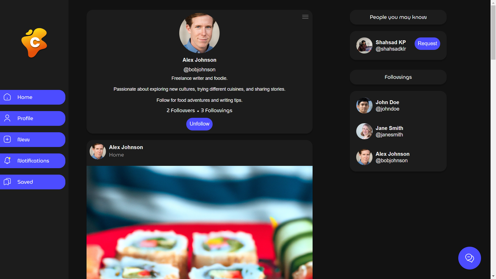
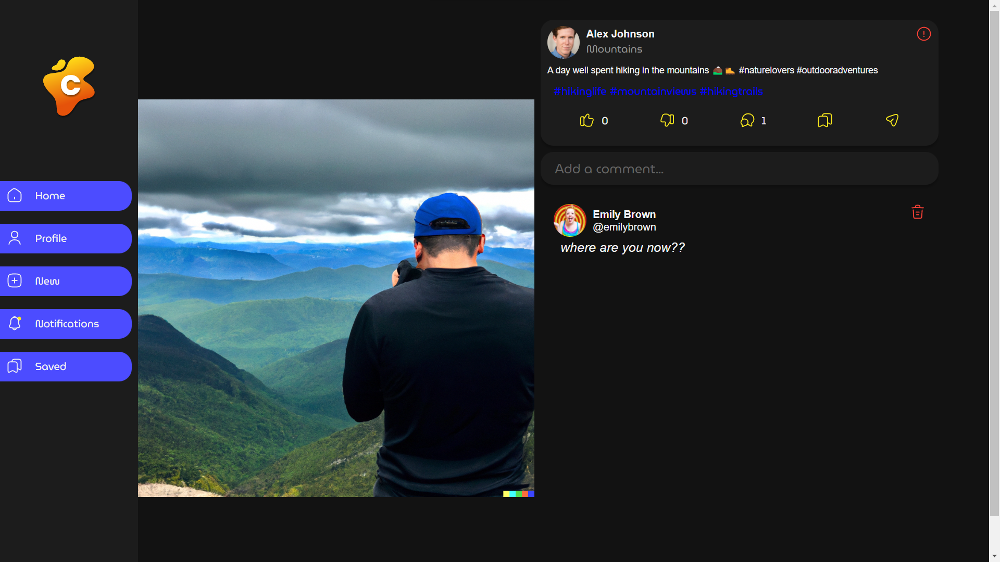
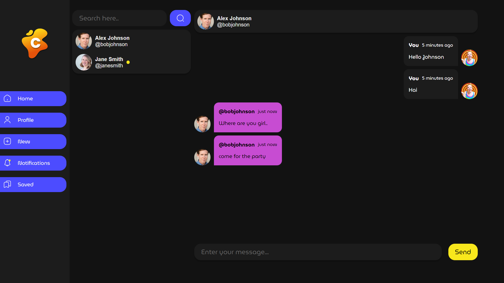
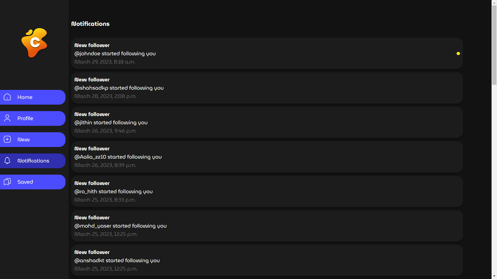
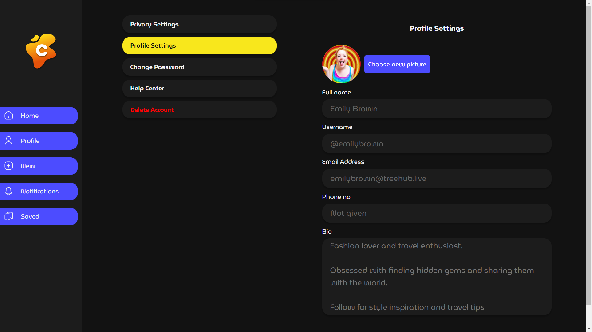

# Django Social Network

A Django 4.1 -based open source social network application.
## Badges
[](https://github.com/shahsad-kp/connectionhubk/issues)
[](https://github.com/shahsad-kp/connectionhubk/fork)
[](https://github.com/shahsad-kp/connectionhub)


## Features

- User authentication and authorization using Django's built-in authentication system
- A newsfeed that displays posts from users that the user follows
- The ability to search for other users and send friend requests
- A messaging system to communicate with friends in real-time
- An admin panel to manage users, posts, and other site content
- A help message feature to assist users with any questions or issues they may have
- User reporting to flag inappropriate content or behavior
- Private account settings to control who can see a user's content
- The ability to block other users who are causing issues or making users uncomfortable


## Installation
1. Clone or download this repository and open it in your editor of choice: 
```bash
git clone https://github.com/shahsad-kp/ConnectionHub.git
```
2. cd into project repository.
```bash
 cd ConnectionHub
 ``` 
3. To get this project up and running you should start by having Python installed on your computer. It's advised you create a virtual environment to store your projects dependencies separately. You can install virtualenv with

```bash
sudo apt install python3-venv
```
4. Within the directory run the following command to create your new virtual environment:
```bash
python3 -m venv my-project-env
```
The command above creates a directory called my-project-env, which contains a copy of the Python binary, the Pip package manager, the standard Python library and other supporting files.

5. To start using this virtual environment, you need to activate it by running the activate script:
```bash
source my-project-env/bin/activate.
```
Once activated, the virtual environment’s bin directory will be added at the beginning of the $PATH variable. Also your shell’s prompt will change and it will show the name of the virtual environment you’re currently using. In our case that is 
```bash 
(my-project-env) $
```
Now that the virtual environment is activated, we can start installing, upgrading, and removing packages using pip.

6. The first step is to install the module,using the Python package manager, pip:
```bash
pip -r install requirements.txt
```
Modify `ConnectionHub/setting.py` with database settings based on your requirements


7. Run the following commands in the root folder.
```bash
python manage.py makemigrations
python manage.py migrate
```
8. Also create a superuser by :
```bash
python manage.py createsuperuser
```
9. To get start runserver locally by:
```bash
python manage.py runserver
```
Open up a browser and visit: http://127.0.0.1:8000/ , then you will see the application.
## Screenshots










## Support
Show your support by 🌟 the project!!
